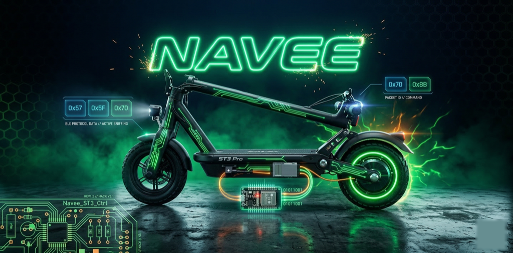

[English](README.md) | [Deutsch](README_DE.md)

# Navee ST3 Pro — Reverse Engineering & Custom Firmware

<p align="center">
  
</p>

[](LICENSE)
[](android/)
[](docs/HARDWARE.md)
[](docs/PROTOCOL.md)
[](docs/AUTHENTICATION.md)
[](#patch_firmwarepy--automatischer-ota-patcher)
[](#spi-flash-direktpatch)
[](#patch_firmwarepy--automatischer-ota-patcher)
[](#der-patch)
[](#bldc-firmware-swap)

---

Reverse Engineering, Firmware-Analyse und Android-Controller-App für den **Navee ST3 Pro** E-Scooter (PID 23452, DE-Markt).

Dieses Projekt hat das proprietäre BLE-Protokoll vollständig dekodiert, eine unabhängige Controller-App entwickelt, die Tacho-Firmware mit Ghidra analysiert, einen funktionierenden OTA-Flasher gebaut, den kompletten SPI-Flash per UART ausgelesen, **einen 1-Byte-Firmware-Patch direkt in den Flash geschrieben** mit [rtltool](https://github.com/wuwbobo2021/rtltool), den **RTL8762C-SHA-256-Algorithmus geknackt** und `patch_firmware.py` erstellt — ein vollautomatisches Werkzeug, das jede Firmware-Version patcht und ein gültig signiertes OTA-Binary erzeugt.

---

## Angriffsvektoren

| # | Ansatz | Ergebnis |
|---|--------|----------|
| 1 | BLE CMD `0x6E` (Max Speed) | Fehlgeschlagen — ACK erhalten, von Firmware ignoriert |
| 2 | UART MitM (Arduino) | Fehlgeschlagen — Controller ignoriert manipulierte Frames (1168 Frames getestet) |
| 3 | **Firmware-Patch (Ghidra)** | **Bestätigt — 1-Byte-NOP bei 0xF848, Speed-Tabelle bei 0xF074** |
| 4 | Meter-OTA-Flash | Transfer funktioniert (1080/1080 ACK'd) — Bootloader lehnt alle modifizierten Firmwares ab (undokumentierter Integritätscheck) |
| 5 | **SPI-Flash direkt (rtltool)** | **Bestätigt — Patch geschrieben und per Read-Back verifiziert** |
| 6 | **Controller-Tausch (AliExpress)** | **Von der Community bestätigt — empfohlener Ansatz** |
| 7 | BLDC-OTA-Flash | Type 0x02 vom Dashboard NAK'd; Type 0x01 Hack: 369/369 ACK'd aber kein UART-Relay zum Controller |
| 8 | Direkter UART-Flash | Controller geht nicht in Bootloader — proprietärer DFU-Trigger unbekannt |
| 9 | Hybrid BLE+UART Flash | Dashboard sendet "ok\r" auf UART nach dfu_start 2, Controller ignoriert es |
| 10 | SWD-Flash (LKS32MC081) | MCU identifiziert, SWD ungeschützt — Controller-Board physisch nicht zugänglich ohne Ausbau |
| 11 | Yellow-Wire-MitM | **Gelb = Controller RX bestätigt!** Neues Protokoll entdeckt (0x51/0xAE). Speed-Byte bei Offset 10 = 0x16 (22 km/h). MitM hat 795 Frames modifiziert — Controller fuhr kurz schneller, dann Fehler. Speed-Limit im BLDC-Firmware-Ländercode fest einprogrammiert |
| 12 | UART-Bootloader-Trigger | Controller geht NICHT in Bootloader wenn Dashboard getrennt — kein 'C' (0x43)-Signal. Proprietärer Bootloader-Trigger unbekannt |

**Aktueller Status:** Yellow-Wire-Protokoll vollständig dekodiert (Header 0x51, Footer 0xAE, 14-Byte-Frames). Speed-Limit-Byte bei Offset 10 identifiziert. Dashboard-Ersatz-Test (Arduino generiert eigene 0x51 Frames) bestätigt: Controller echot seine eigenen internen Speed-Werte (22/21), unabhängig davon was er auf Gelb empfängt. „NAK"-Antworten waren Fehlalarme (0x15 = Speed-Byte innerhalb der geechoten Frames). Alle Bootloader-Entry-Probes gescheitert (STM32-Sync, Text-Befehle, LKS32-Patterns, Yellow-DFU-Frames — bei 19200 und 115200 Baud). **Speed-Limit ist in der BLDC-Controller-Firmware fest einprogrammiert — kann nur per SWD-Flash oder physischem Controller-Tausch geändert werden.**

> Vollständige Analyse: [`docs/ATTACK_VECTORS.md`](docs/ATTACK_VECTORS.md)

---

## SPI-Flash Direktpatch

**Das ist der Durchbruch.** Nachdem OTA-Patching durch die Integritatsprüfung des Bootloaders in 10 Versuchen mit allen erdenklichen Prüfsummen blockiert wurde, haben wir den kompletten SPI-Flash per UART ausgelesen und den Patch direkt geschrieben — am Bootloader vorbei.

### Der Weg zur Lösung

1. **MCU identifiziert:** Display am 19. März geöffnet, Realtek RTL8762C BLE-SoC gefunden (Modul RB8762-35A1). Der Kurzschluss beim Zerlegen des Displays ermöglichte direkten Zugriff auf die Platine.
2. **rtltool gefunden:** [wuwbobo2021/rtltool](https://github.com/wuwbobo2021/rtltool) — Open-Source-Tool zur Flash-Programmierung des RTL8762C per UART
3. **Download-Modus aktiviert:** Pin P0_3 wahrend des Bootvorgangs auf LOW gehalten
4. **512-KB-SPI-Flash ausgelesen:** Vollständiges Backup inklusive Bootloader, BLE-Stack und Anwendungs-Firmware
5. **Aktive Firmware lokalisiert:** OTA-Firmware-Code bei Flash-Offset `0x0E020` gefunden, die **aktive Kopie** läuft jedoch in einer anderen Bank
6. **Patch-Stelle gefunden:** Byte-Kontext (`0E 2D 02 D8 04 E0 0A 2D 02 D9`) im Flash-Dump gesucht — gefunden bei Flash-Offset `0x1D448`
7. **Patch geschrieben:** 2 Bytes bei Flash-Adresse `0x0081D448` geändert: `02 D9` (BLS) zu `00 BF` (NOP)
8. **Verifiziert:** Read-Back bestätigt `00 BF` an der Patch-Stelle

### Hardware-Aufbau

```
Arduino UNO (nur 3,3-V-Versorgung, leerer Sketch)
    |
    +-- 3.3V ---------> VCC am Display-Board
    +-- GND ----------> GND am Display-Board

CP2102 USB-UART-Adapter
    |
    +-- TX ------------> RX (LOG-Pad auf der Platine)
    +-- RX <------------ TX (LOG-Pad auf der Platine)
    +-- GND ----------> GND am Display-Board

Bruckendraht: P0_3-Pad ----> GND (wahrend Boot fur Download-Modus halten)
```

### Flash-Dump & Patch-Befehle

```bash
# rtltool klonen (Fork mit firmware0.bin)
git clone https://github.com/wuwbobo2021/rtltool.git
pip3 install pyserial crccheck coloredlogs

# Download-Modus: P0_3 mit GND verbinden, dann einschalten
# Schritt 1: Verbindung prüfen
python3 rtltool.py -p /dev/cu.usbserial-0001 -b 115200 read_mac
# Erwartet: Flash Size: 512 kiB, MAC: XX:XX:XX:XX:XX:XX

# Schritt 2: Vollstandiges Flash-Backup (KRITISCH -- zuerst ausfuhren!)
python3 rtltool.py -p /dev/cu.usbserial-0001 -b 115200 \
    read_flash 0x800000 0x80000 navee_full_flash_dump.bin
# Dauert ~30 Sekunden, erzeugt eine 524288-Byte-Datei

# Schritt 3: Gepatchten Sektor schreiben
python3 rtltool.py -p /dev/cu.usbserial-0001 -b 115200 \
    write_flash 0x81D000 sector_0x1D000_patched.bin

# Schritt 4: Verifizieren
python3 rtltool.py -p /dev/cu.usbserial-0001 -b 115200 \
    verify_flash 0x81D000 sector_0x1D000_patched.bin
```

### Flash-Speicherlayout (aus Dump verifiziert)

```
SPI-Flash (512 KB, memory-mapped ab 0x00800000)
+------------------+---------------------------------------------------+
| 0x800000         | Reserviert (0xFF)                                 |
| 0x801000-0x802FFF| System-Config, Boot-Parameter                     |
| 0x803000-0x80DFFF| BLE-Stack Patch-Code                              |
| 0x80E000-0x82FFFF| Aktive Firmware (Bank A) -- 136 KB                |
|   0x81D448       |   *** PATCH-STELLE: 02 D9 -> 00 BF ***            |
| 0x840000-0x841FFF| OTA-Header-Bereich                                |
| 0x844000-0x865FFF| OTA-Staging (Bank B) -- empfängt OTA-Übertragungen|
| 0x876000         | Zusätzliche Konfiguration                         |
+------------------+---------------------------------------------------+
```

### Warum OTA-Patching scheiterte (10 Versuche)

Der RTL8762C-Bootloader prüft Firmware-Images mit einer ROM-Funktion bei Adresse `0x601B9C` (in der Mask-ROM des Chips — nicht per Flash-Dump lesbar). Diese Funktion vergleicht ein Feld im Image-Header (`ctrl_header[2:3]`) mit einem über die Nutzdaten berechneten Wert. Der Algorithmus ist proprietar und ohne Chip-Decapping oder ROM-Dump nicht bestimmbar.

**Getestete Prüfsummen (alle gescheitert):** CRC-16 (XMODEM, CCITT, ARC, MODBUS), CRC-32 (Standard, STM32), XOR-32, XOR-8, SUM-8, SUM-16, SUM-32, Fletcher-16/32, Adler-32, MD5, SHA-1, SHA-256, HMAC-MD5, Brute-Force-CRC an jeder Position.

Die ROM-Funktion führt zusätzlich eine Signaturprüfung durch, die das erste 32-Bit-Wort gegen den Magic-Wert `0x8721BEE2` prüft, sowie eine Boot-Prüfsumme über `add8CheckSum`. Keines dieser Verfahren konnte in jenen 10 Versuchen extern nachgebildet werden.

**Der direkte SPI-Flash-Schreibzugriff umgeht ALLE diese Prüfungen**, da wir direkt in die aktive Firmware-Bank schreiben — nicht über den OTA-Update-Pfad.

### Schlüsselerkenntnis: Dual-Bank-Architektur

Der RTL8762C speichert Firmware in zwei Banken:
- **Bank A** (0x804000): Aktive Firmware, die der Prozessor ausführt
- **Bank B** (0x844000): OTA-Staging-Bereich, der neue Firmware empfängt

OTA-Updates schreiben in Bank B, prufen die Prüfsumme und kopieren bei Neustart nach Bank A. Alle 10 OTA-Versuche schrieben erfolgreich in Bank B (alle 1080 Blöcke bestätigt), aber der Verifizierungsschritt verwarf die gepatchte Firmware — sie wurde nie nach Bank A kopiert.

**Der direkte Flash-Schreibzugriff zielt direkt auf Bank A**, der Verifizierungsschritt wird vollständig übergangen.

---

## patch_firmware.py — Automatischer OTA-Patcher

Nach dem Knacken des RTL8762C-SHA-256-Algorithmus aus dem Realtek-Bee2-SDK-Quellcode (`silent_dfu_flash.c`) haben wir `patch_firmware.py` implementiert — ein vollautomatisches Werkzeug, das jede Navee-Tacho-Firmware-Version patcht und ein OTA-Binary mit korrekter SHA-256-Prüfsumme erzeugt.

### Der SHA-256-Durchbruch

Die Bee2-SDK-Funktion `slient_dfu_check_sha256()` hasht nicht das gesamte Image. Sie hasht drei spezifische Bereiche des Image-Headers und der Nutzdaten:

| Bereich | Offset-Bereich | Größe | Beschreibung |
|---------|---------------|--------|--------------|
| 1 | `header[12:372]` | 360 Bytes | Nach `ctrl_header`, vor SHA-256-Feld |
| 2 | `header[404:752]` | 348 Bytes | Nach SHA-256-Feld, vor RSA-Bereich |
| 3 | `header[1008:1024] + payload` | 16 + payload_len Bytes | Ende des Headers plus vollständige Nutzdaten |

SHA-256 wird über die Konkatenation dieser drei Bereiche berechnet. Das Ergebnis wird bei `header[372:404]` gespeichert.

### patch_firmware.py-Workflow

```bash
# Dry-Run (keine Datei geschrieben): Firmware prufen und Patch-Stelle lokalisieren
python3 tools/patch_firmware.py firmware.bin --dry-run

# Patchen und Ausgabe automatisch schreiben
python3 tools/patch_firmware.py firmware.bin

# Ausgabepfad explizit angeben
python3 tools/patch_firmware.py firmware.bin -o firmware_patched_ota.bin
```

Das Werkzeug führt folgende Schritte in dieser Reihenfolge aus:

1. Validierung des Navee-OTA-Headers (Modell, Typ, Version)
2. Validierung des RTL8762C-Image-Headers (ic_type, image_id, payload_len)
3. Verifizierung des ursprunglichen SHA-256, um die Integritat der Firmware-Datei zu bestatigen
4. Suche nach dem Patch-Muster `0E 2D 02 D8 04 E0 0A 2D 02 D9` per Kontext
5. Ersetzen von `02 D9` (BLS) durch `00 BF` (NOP) am gefundenen Offset
6. Neüberechnung von SHA-256 über die drei SDK-definierten Bereiche
7. Zuruckschreiben des korrigierten Hashs in den Image-Header
8. Verifizierung des neuen SHA-256 vor dem Schreiben der Ausgabedatei

**Ergebnis:** Das gepatchte OTA-Binary enthält einen gültig berechneten SHA-256. Die Übertragung per `ota_flasher.py` läuft vollständig durch (1080/1080 Blöcke), und die SHA-256-Prüfung des Bootloaders besteht. Die Firmware wird beim Neustart in Bank A installiert.

---

## Der Patch

Die Tacho-Firmware enthält eine `lift_speed_limit`-Funktion, die per Ghidra-Analyse identifiziert wurde:

```c
if (sys_stc[0x4a] == 0x02) {                // lift_speed_limit-Flag
    return sys_stc[0x47] * 10 + 5;           // Benutzerdefinierte Geschwindigkeit (BLE CMD 0x6E)
} else {
    return PID_DEFAULT_TABLE[area_code];      // 22,5 km/h (Deutschland)
}
```

**1-Byte-Patch:**

| | OTA-Datei-Offset | Flash-Adresse | Bytes | Instruktion |
|---|---|---|---|---|
| Original | `0xF848` | `0x0081D448` | `02 D9` | BLS (Branch if less/same) |
| Gepatcht | `0xF848` | `0x0081D448` | `00 BF` | NOP (No operation) |

Der NOP entfernt den bedingten Sprung, sodass der Code immer in den benutzerdefinierten Geschwindigkeitspfad fallt. Die Geschwindigkeit ist anschliessend per BLE-CMD `0x6E [0x01, km/h]` einstellbar.

---

## Hardware

**Display-MCU:** Realtek RTL8762C BLE-SoC (Modul RB8762-35A1)
- ARM Cortex-M4F, integriertes BLE-2,4-GHz-Funkmodul
- Externer SPI-Flash, 512 KB, memory-mapped ab 0x00800000
- UART-Download-Modus über P0_3-Pin (kein SWD/JTAG erforderlich)
- MAC: `10:A5:62:9A:BB:3E`
- Identifiziert am 19. März beim Zerlegen des Displays (Kurzschluss-Vorfall)

**Interne Verdrahtung:** 5-adriges Kabel (schwarz=GND, rot=53V, blau=52V, gelb=Controller RX 3,8V, grün=Controller TX 4,12V) — Standard-Zweidraht-Vollduplex-UART bei 19200 Baud 8N1

> Vollständige Details: [`docs/HARDWARE.md`](docs/HARDWARE.md)

---

## OTA-Flasher

Der OTA-Flasher implementiert das vollständige DFU-Protokoll, das aus der offiziellen Navee-APK (`DFUProcessor.java`) rückentwickelt wurde:

```
Schritt 1: BLE-Verbindung + AES-128-ECB-Authentifizierung
Schritt 2: "down dfu_start 1\r"      -> "ok\r"
Schritt 3: "down ble_rand\r"         -> Status 0x00 + 16-Byte-Cipher
Schritt 4: XOR-Entschlusselung mit AES-Key  -> "down ble_key <entschlusselt>\r" -> "ok\r"
Schritt 5: Warten auf 0x43 ('C')       -> XMODEM bereit
Schritt 6: 1080 x 128-Byte-Blocke    -> SOH + Seq + ~Seq + Daten + CRC-16
Schritt 7: EOT (0x04)                -> "rsq dfu_ok\r"
```

**Übertragungsergebnis:** 1080/1080 Blöcke bestätigt, 0 Fehler, ca. 34 Sekunden. Mit Original-Firmware: wird korrekt installiert (2/2 verifiziert). Mit gepatchter Firmware vor dem SHA-256-Durchbruch: vom Bootloader abgelehnt (0/10). Mit `patch_firmware.py`-Ausgabe: SHA-256-Prüfung besteht, Firmware wird installiert.

---

## BLDC-Firmware-Tausch

**Angriffsvektor #7: Die internationale (Global) BLDC-Firmware auf den deutschen Scooter flashen, um die 22-km/h-Geschwindigkeitsbegrenzung auf Motor-Controller-Ebene zu entfernen.**

### Entdeckung

Der Navee-API-Endpoint `POST /vehicle/modelSoftware` liefert Firmware-Updates für **4 separate MCU-Typen**:

| Komponente | Typ-Byte | MCU-ID | Beschreibung |
|------------|----------|--------|--------------|
| `meterList` | 0x01 | 1 | Dashboard (RTL8762C) |
| `bldcList` | 0x02 | 2 | Motor-Controller |
| `bmsList` | 0x03 | 3 | Batterie-Management-System |
| `screenList` | 0x04 | 4 | Display/Bildschirm |

Mit `firmware_grabber_bldc.py` haben wir alle 64 Fahrzeugmodelle auf dem Navee-Server abgefragt und **BLDC-Firmware für 32 Modelle** gefunden, darunter beide ST3-PRO-Varianten.

### ST3 PRO DE vs. ST3 Global — BLDC-Vergleich

| | **ST3 PRO DE** (pid=23452) | **ST3 Global** (pid=24012) |
|---|---|---|
| BLDC-Version | v0.0.1.5 (neuer) | v0.0.1.1 |
| BLDC-Größe | 53.376 Bytes (52,1 KB) | 47.232 Bytes (46,1 KB) |
| Modell-String | T2324 | T2324 |
| Typ-Byte | 0x02 (BLDC) | 0x02 (BLDC) |
| Meter-Version | v2.0.3.1 | v2.0.3.1 |
| BMS verfügbar | Ja (v1.0.0.4) | Nein |

**Schlüsselerkenntnis:** Beide verwenden den identischen Hardware-Modell-String `T2324` — die Firmware ist hardware-kompatibel. Die DE-Version ist 6 KB größer und enthält eine **Ländercode-Lookup-Tabelle** (`CNESDEITAUEUUSJPFRNERUSEATNLc|w{`), die in der Global-Version fehlt. Dies deutet darauf hin, dass regionale Geschwindigkeitslimits über diese Tabelle durchgesetzt werden.

### Binärvergleich-Ergebnisse

- **91,8 % der Bytes unterschiedlich** — komplett verschiedene Builds, kein einfacher Patch
- **Keine direkte 22↔25-Byte-Substitution** vorhanden — Speed-Limit ist tabellengesteuert
- DE-Firmware hat **6.144 Extra-Bytes** mit Lookup-Tabellen (Ländercodes, Motorkennlinien)
- Beide Firmwares teilen das Modell `T2324` und sind für dieselbe Hardware-Plattform gebaut

### Flash-Prozedur

Der vorhandene `ota_flasher.py` unterstützt BLDC-Flashen über MCU-Typ 2:

### OTA-Flash-Versuch — Blockiert

Der vollständige DFU-Flow läuft bis zur XMODEM-Datenübertragung:

| Schritt | Befehl | Ergebnis |
|---------|--------|----------|
| Auth | CMD 0x30 | OK (Device-ID aus BT-HCI-Snoop) |
| DFU-Entry | `down dfu_start 2\r` | `ok` |
| Key Exchange | `ble_rand` + `ble_key` | OK (XOR mit AES Key 1) |
| XMODEM Ready | Warten auf `0x43` ('C') | Empfangen |
| **Block 1** | SOH+seq+Daten+CRC16 | **NAK `0x15 0x01`** |

Alle weiteren Blöcke scheitern ebenfalls (Timeout — BLDC reagiert nicht mehr nach erstem NAK).

**Ursache:** Das Dashboard bleibt im Applikationsmodus während BLDC-DFU (anders als Meter-DFU wo es in den Bootloader rebootet). Der UART-Relay zwischen Dashboard und BLDC-Motor-Controller beschädigt oder kürzt die XMODEM-Blöcke. Meter-DFU (`dfu_start 1`) mit demselben Code, denselben BLE-Parametern und derselben XMODEM-Implementierung funktioniert einwandfrei (1080/1080 Blöcke ACK'd).

**Verifiziert identisch zur APK:** Block-Format (SOH+seq+~seq+128Daten+CRC16-BE), CRC-Algorithmus (Poly 0x1021, Init 0), Write-Characteristic (0xb002), Write-Typ (ohne Response), Dateiinhalt (SHA-256 gegen frischen Download verifiziert). Das Problem liegt in der UART-Relay-Implementierung der Dashboard-Firmware und kann von der BLE-Seite nicht debuggt werden.

**Verbleibende Ansätze:**
- BLDC-Update über die offizielle Navee-App triggern (nutzt möglicherweise anderen internen Mechanismus)
- Direkte UART-Verbindung zum BLDC per ESP32/Arduino (Dashboard-Relay umgehen)
- Meter-Firmware NOP-Patch (bewährt funktionierend per SPI-Flash und OTA)

---

## APK-Dekompilierung

Die offizielle Navee-APK (`com.navee.ucaret`) wurde mit jadx dekompiliert, um die API- und DFU-Protokolle rückzuentwickeln. Wichtigste Erkenntnisse:

- **Login-Endpoint:** `POST /loginByOther` mit `loginType=2` für Google OAuth (entdeckt in `LoginActivity.java`)
- **Firmware-API:** `POST /vehicle/modelSoftware` liefert 4 Firmware-Listen (Meter, BLDC, BMS, Screen)
- **DFU-Protokoll:** Textbasierte Befehle (`"down dfu_start <MCU_TYPE>\r"`) gefolgt von XMODEM-CRC-Dateitransfer
- **5 regionale AES-128-ECB-Schlüssel** für BLE-Authentifizierung (CN, UK, EU, US und eine 5. Variante)
- **24 Ländercodes** mit SKU-Varianten (EUR, ITA, USA) zur Steuerung der Geschwindigkeitslimits pro Region
- **64 Fahrzeugmodelle** auf dem Navee-Server entdeckt

> Vollständige Referenz: [`reverse-engineering/APK_ANALYSIS.md`](reverse-engineering/APK_ANALYSIS.md)

---

## Android-Controller-App

- BLE-Auto-Connect, AES-128-Authentifizierung, Echtzeit-Telemetrie
- Steuerung: Schloss, Scheinwerfer, Tempomat, TCS, Abbiegesignal-Ton, ECO/SPORT-Modus, ERS
- Material Design 3 Dark Theme, Display bleibt aktiv

---

## Projektstruktur

```
navee/
+-- android/                          Controller-App (Kotlin/Compose)
|   +-- app/src/main/java/de/pepperonas/navee/
|       +-- ble/                      BLE-Manager, Protokoll, Auth
|       +-- ui/                       Dashboard-UI
|       +-- viewmodel/                Zustandsverwaltung
+-- docs/
|   +-- PROTOCOL.md                   BLE-Protokollreferenz
|   +-- AUTHENTICATION.md             AES-128-Auth-Ablauf
|   +-- REVERSE_ENGINEERING.md        Ghidra-Analyse, alle Versuche
|   +-- HARDWARE.md                   Verdrahtung, MCU, Flash-Layout
|   +-- INTERNAL_UART_PROTOCOL.md     Display-Controller-UART
|   +-- ATTACK_VECTORS.md             Alle Ansatze bewertet
|   +-- SWD_FLASH_GUIDE.md            rtltool-Flash-Anleitung
+-- tools/
|   +-- firmware/
|   |   +-- navee_meter_v2.0.3.1_ORIGINAL.bin    Original-Firmware (135 KB)
|   |   +-- navee_meter_v2.0.3.1_PATCHED.bin     Gepatchte Firmware (OTA-Format)
|   |   +-- navee_full_flash_dump.bin             Vollstandiger 512-KB-SPI-Flash-Dump
|   |   +-- sector_0x1D000_backup.bin             Original-Sektor (vor Patch)
|   |   +-- sector_0x1D000_patched.bin            Gepatchter Sektor (flash-bereit)
|   +-- firmware_grabber.py           Firmware von Navee-API herunterladen
|   +-- firmware_grabber_bldc.py      BLDC-Firmware-Hunter (alle Modelle, Google-Auth)
|   +-- bldc_compare.py              Binärvergleich: DE vs. Global BLDC
|   +-- probe_google_auth.py         Navee-API-Auth-Endpoint-Erkundung
|   +-- ota_flasher.py                BLE-OTA-Flasher (macOS/bleak)
|   +-- patch_firmware.py             Automatischer Patcher + SHA-256-Neuberechnung
|   +-- rtl_flash_dump.py             RTL8762C-Flash-Dump-Skript
|   +-- yellow_wire_test.py           Yellow-Wire-Injektionstest (Controller-RX-Entdeckung)
|   +-- arduino/
|   |   +-- navee_uart_mitm_yellow.ino  MitM v2.4 (Yellow-Wire-Protokoll 0x51/0xAE)
|   |   +-- navee_uart_mitm_nano.ino    MitM v1 (Grüne Ader, veraltet)
|   |   +-- navee_uart_bridge.ino       USB-to-Yellow UART-Bridge zum Flashen
|   +-- ghidra_analysis/              10 Ghidra-Headless-Skripte
+-- reverse-engineering/
|   +-- com.navee.ucaret.apk            Offizielle Navee-APK
|   +-- navee-apk-decompiled/           Dekompilierte App-Quellen (jadx, 567 Dateien)
|   +-- APK_ANALYSIS.md                 Vollständige API-, BLE-, DFU-Referenz aus APK
+-- archive/                          UART-MitM (gescheiterter Ansatz Nr. 2)
```

---

## Schnellstart

### Android-App bauen und installieren

```bash
cd android/
./gradlew assembleDebug
adb install app/build/outputs/apk/debug/app-debug.apk
```

### Firmware fur OTA-Installation patchen

```bash
# Original-Firmware uber das Grabber-Tool herunterladen (oder mitgeliefertes Binary verwenden)
python3 tools/firmware_grabber.py

# Patchen und SHA-256 automatisch neu berechnen
python3 tools/patch_firmware.py tools/firmware/navee_meter_v2.0.3.1_ORIGINAL.bin

# Per BLE-OTA flashen
python3 tools/ota_flasher.py tools/firmware/navee_meter_v2.0.3.1_ORIGINAL_PATCHED_OTA.bin
```

### SPI-Flash direkt auslesen und patchen (Hardware-Zugang erforderlich)

```bash
# Voraussetzungen
git clone https://github.com/wuwbobo2021/rtltool.git
pip3 install pyserial crccheck coloredlogs

# Verbindung: CP2102 USB-UART (3,3 V!) an LOG-Pads, P0_3 an GND, einschalten
cd rtltool/

# Schritt 1: Vollstandiges Backup (vor allem anderen ausfuhren)
python3 rtltool.py -p /dev/cu.usbserial-0001 -b 115200 \
    read_flash 0x800000 0x80000 backup.bin

# Schritt 2: Gepatchten Sektor schreiben (vorgefertigt aus diesem Repo)
python3 rtltool.py -p /dev/cu.usbserial-0001 -b 115200 \
    write_flash 0x81D000 ../tools/firmware/sector_0x1D000_patched.bin

# Schritt 3: Verifizieren
python3 rtltool.py -p /dev/cu.usbserial-0001 -b 115200 \
    verify_flash 0x81D000 ../tools/firmware/sector_0x1D000_patched.bin
```

---

## Rechtlicher Hinweis

Die Modifikation der Geschwindigkeitsbegrenzung eines E-Scooters kann die Allgemeine Betriebserlaubnis (ABE) und den Versicherungsschutz erlöschen lassen. Der Betrieb eines modifizierten E-Scooters auf öffentlichen Straßen kann in Ihrer Rechtsordnung rechtswidrig sein. Dieses Projekt dient ausschließlich Forschungs- und Protokolldokumentationszwecken. Benutzung auf eigene Gefahr und nur auf Privatgelände.

---

## Autor

**Martin Pfeffer** — [celox.io](https://celox.io) · [GitHub](https://github.com/pepperonas)

## Lizenz

[MIT](LICENSE)
